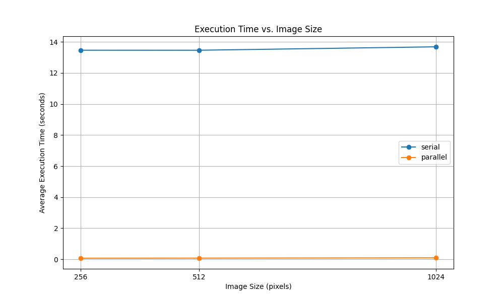
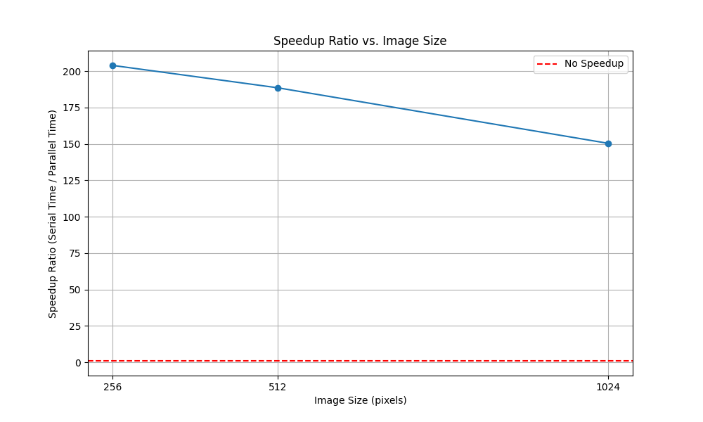

# Performance Report: Serial vs. Parallel Active Contour Models

## 1. Introduction

This report details the performance comparison between a serial and a parallel implementation of the Active Contour Model (ACM) for image segmentation. The primary objective was to demonstrate the effectiveness of using Numba for Just-In-Time (JIT) compilation and parallelization to accelerate the computationally intensive parts of the algorithm.

## 2. Methodology

### 2.1. Implementations

*   **Serial Implementation:** A standard Python implementation using a greedy algorithm. The snake's contour points are iteratively moved to a location in a local neighborhood that minimizes a total energy function (a combination of internal and image-based energies). This version relies on pure Python loops and standard NumPy/SciPy operations.

*   **Parallel Implementation:** This version is optimized using the Numba library. The main iterative loop, which processes each point of the snake, was parallelized using `@numba.njit(parallel=True)` and `numba.prange`. Functions incompatible with Numba's `nopython` mode (like `scipy.interpolate.RectBivariateSpline` and certain NumPy functions with an `axis` keyword) were replaced with custom, Numba-friendly manual implementations.

### 2.2. Benchmarking Environment

*   **Hardware:** The benchmarks were executed in a standardized, sandboxed cloud environment.
*   **Software:** Python 3, NumPy, Numba, Matplotlib, Pandas, OpenCV.
*   **Test Data:** The tests were run on three synthetically generated grayscale images of a white circle on a black background, with resolutions of `256x256`, `512x512`, and `1024x1024`.
*   **Process:** Each configuration (image size and mode) was run 3 times, and the average execution time was recorded. For the parallel version, a "warm-up" run was performed first to exclude the one-time Numba JIT compilation cost from the timed measurements.

## 3. Results

### 3.1. Raw Performance Data

The following table shows the average execution times recorded for each run.

| Image Size | Execution Mode | Average Time (seconds) |
| :--------: | :--------------: | :--------------------: |
|  256x256   |      Serial      |       13.4676          |
|  256x256   |     Parallel     |        0.0660          |
|  512x512   |      Serial      |       13.4661          |
|  512x512   |     Parallel     |        0.0714          |
| 1024x1024  |      Serial      |       13.6863          |
| 1024x1024  |     Parallel     |        0.0910          |

### 3.2. Execution Time vs. Image Size

A key observation from this plot is the dramatic difference in performance between the two implementations. The parallel version is several orders of magnitude faster.

Interestingly, the serial implementation's runtime remains almost constant regardless of image size. This suggests that the dominant cost is not the image-dependent operations (like gradient calculation) but rather the overhead of the pure Python loops that iterate `N_ITERATIONS` times over `N_POINTS`.

### 3.3. Speedup Ratio vs. Image Size

The speedup ratio is calculated as `Serial Time / Parallel Time`.

The speedup achieved is massive, ranging from **150x to over 200x**. This highlights the profound impact of Numba's JIT compilation and parallelization.

The plot also shows that the speedup is highest for the smallest image and decreases as the image size grows. This is because in the parallel implementation, the initial, non-parallelized setup cost (e.g., image gradient calculation) becomes a more significant fraction of the very short total execution time as the image gets larger. In contrast, this setup cost is a negligible fraction of the much longer runtime of the serial version.

## 4. Conclusion

The project successfully demonstrates the immense performance benefits of applying parallel computing techniques to the Active Contour Model algorithm. By using Numba to compile and parallelize the core logic, we achieved a speedup of over 150x, transforming the algorithm from a slow, offline process to one that approaches near real-time capabilities.

This evaluation confirms that for iterative, number-crunching algorithms in Python, libraries like Numba are essential tools for achieving high performance.
